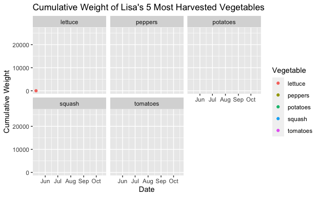

```{r setup, include=FALSE}
knitr::opts_chunk$set(echo = TRUE)
```

## R Markdown

This is an R Markdown document. Markdown is a simple formatting syntax for authoring HTML, PDF, and MS Word documents. For more details on using R Markdown see <http://rmarkdown.rstudio.com>.

When you click the **Knit** button a document will be generated that includes both content as well as the output of any embedded R code chunks within the document. You can embed an R code chunk like this:

```{r}
library(googlesheets4)
library(lubridate)
library(ggplot2)
library(dplyr)
library(gganimate)
library(transformr)
gs4_deauth()
harvest_2021 <- read_sheet("https://docs.google.com/spreadsheets/d/1DU6dpxrbPGW2oJHQ6TG_xibazoGhvmRcqk2iPGOaRUI/edit?usp=sharing") %>%
mutate(date = ymd(date))
```

## Including Plots

You can also embed plots, for example:

```{r}
summed_harv <- harvest_2021 %>%
  group_by(vegetable, variety) %>%
  mutate(cume_weight = cumsum(weight)) %>%
  summarise(weight, cume_weight, date)
```

```{r, fig.height=6, fig.width=6}
harv_anim <- summed_harv %>%
  mutate(day = day(date)) %>%
  mutate(month = month(date)) %>%
  filter(vegetable %in% c("lettuce", "peppers", "potatoes", "squash", "tomatoes")) %>%
  ggplot(aes(x = date, y = cume_weight, color = vegetable)) +
  geom_point(aes(group = seq_along(day))) +
  facet_wrap(~vegetable) +
  transition_reveal(date) +
  labs(title = "Cumulative Weight of Lisa's 5 Most Harvested Vegetables", x = "Date", y = "Cumulative Weight", color = "Vegetable")

harv_anim

anim_save("Lisa-garden.gif", harv_anim)
```

```{r}

```

