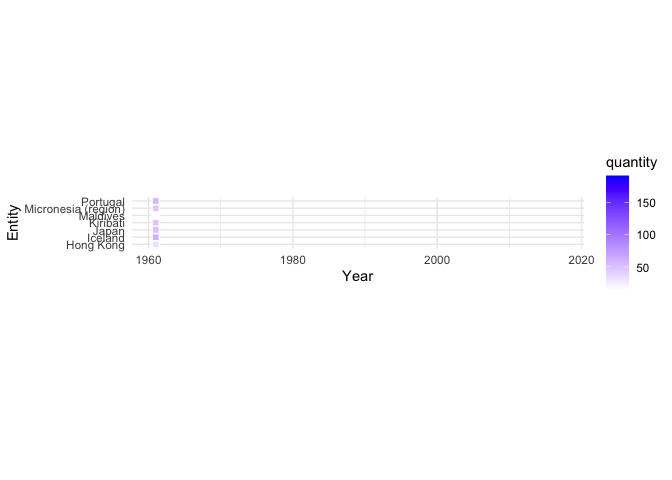
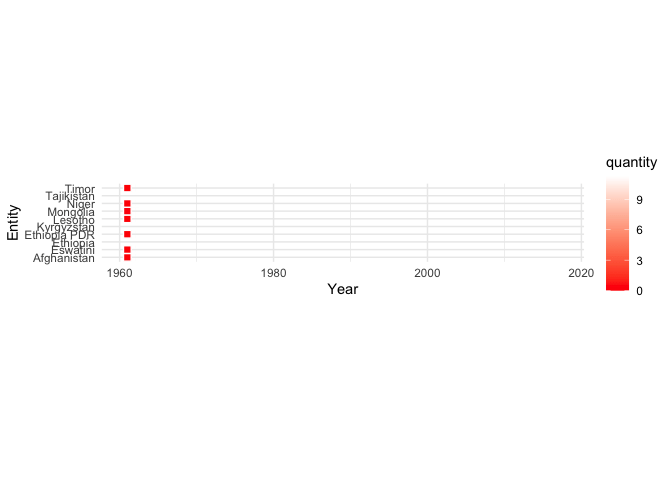

```{r setup, include=FALSE}
knitr::opts_chunk$set(echo = TRUE)
library(ggplot2)
library(dplyr)
library(readxl)
library(lubridate)
library(transformr)
library(ggthemes)
library(viridis)
library(gganimate)
library(hrbrthemes)
```

## R Markdown

This is an R Markdown document. Markdown is a simple formatting syntax for authoring HTML, PDF, and MS Word documents. For more details on using R Markdown see <http://rmarkdown.rstudio.com>.

When you click the **Knit** button a document will be generated that includes both content as well as the output of any embedded R code chunks within the document. You can embed an R code chunk like this:

```{r}
tuesdata <- tidytuesdayR::tt_load(2021, week = 42)
consumption <- tuesdata$`fish-and-seafood-consumption-per-capita`
```

```{r}
nconsumption <- consumption %>%
  mutate(quantity = `Fish, Seafood- Food supply quantity (kg/capita/yr) (FAO, 2020)`) %>%
  select(Entity, Year, quantity)

nconsumption %>%
  filter(quantity > 70) %>%
  ggplot(aes(x = Year, y = quantity, color = Entity)) +
  geom_point()

nconsumption %>%
  filter(quantity < .15) %>%
  ggplot(aes(x = Year, y = quantity, color = Entity)) +
  geom_point()
```

```{r, fig.height=6, fig.width = 6}
top_fishing_anim <- nconsumption %>% 
  filter(Entity %in% c("Hong Kong", "Iceland", "Japan", "Kiribati", "Maldives", "Micronesia (region)", "Portugal")) %>%
  ggplot(aes(x=Year, y=Entity, fill=quantity)) +
  geom_tile(color="white", size=.5) +
  scale_fill_gradient(low="white", high="blue") +
  coord_equal() +
  theme(plot.title=element_text(hjust=0)) +
  theme(axis.ticks=element_blank()) + 
  theme(axis.text=element_text(size=7)) +
  theme_minimal() +
  transition_time(Year) +
  shadow_mark()

animate(top_fishing_anim, height = 800, width = 800)
```

```{r, fig.height=6, fig.width = 6}
lowest_fishing_anim <- nconsumption %>% 
  filter(Entity %in% c("Afghanistan", "Eswatini", "Ethiopia", "Ethiopia PDR", "Kyrgyzstan", "Lesotho", "Mongolia", "Niger", "Tajikistan", "Timor")) %>%
  ggplot(aes(x=Year, y=Entity, fill=quantity)) +
  geom_tile(color="white", size=.5) +
  scale_fill_gradient(low="red", high="white") +
  coord_equal() +
  theme(plot.title=element_text(hjust=0)) +
  theme(axis.ticks=element_blank()) + 
  theme(axis.text=element_text(size=7)) +
  theme_minimal() +
  transition_time(Year) +
  shadow_mark()

animate(lowest_fishing_anim, height = 800, width = 800)
```

```{r}
anim_save("topfish.gif", top_fishing_anim)
anim_save("lowfish.gif", lowest_fishing_anim)
```

```{r}


```
